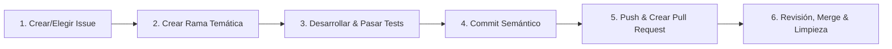

# Skill: Flujo de Trabajo Obligatorio (Issue ➔ Rama ➔ PR ➔ Merge)

Esta skill establece y hace cumplir la regla fundamental de ingeniería de software para este proyecto:
**NINGÚN CAMBIO SE SUBE NI SE CONFIRMA DIRECTAMENTE EN LA RAMA PRINCIPAL (`main` / `master`).**

Todo desarrollo, corrección de errores, refactorización o actualización debe seguir obligatoriamente este protocolo de 6 fases.

---

## Reglas Inquebrantables

1. **Prohibido el commit directo en `main`**: Antes de modificar cualquier archivo, verifica en qué rama te encuentras con `git branch --show-current`. Si estás en `main`, cambia inmediatamente a una rama de trabajo.
2. **Todo PR debe cerrar un Issue**: No se aceptan Pull Requests huérfanos. Cada PR debe contener la directiva `Fixes #<NUMERO>` o `Closes #<NUMERO>`.
3. **Verificación verde obligatoria**: No se abre ni se hace merge de ningún PR sin antes haber ejecutado y superado las pruebas locales y compilación (`npm test`, `flutter test`, `cargo check`, etc.).
4. **Limpieza post-merge**: Toda rama de trabajo debe eliminarse local y remotamente una vez integrada a `main`.

---

## Protocolo Paso a Paso



---

### Fase 1: Identificación o Creación del Issue

Antes de tocar una sola línea de código, debe existir un Issue que describa el problema o la funcionalidad.

1. **Buscar si el issue ya existe**:
   ```bash
   gh issue list --state open
   ```
2. **Si no existe, crear el Issue**:
   ```bash
   gh issue create \
     --title "tipo(alcance): descripción clara del requerimiento" \
     --body "### Descripción\nExplicación detallada del problema o funcionalidad.\n\n### Criterios de Aceptación\n- [ ] Criterio 1\n- [ ] Criterio 2\n- [ ] Tests pasan al 100%"
   ```
3. Anota el número de issue asignado (ejemplo: `#42`).

---

### Fase 2: Creación de la Rama Temática

1. **Asegúrate de partir de la última versión de `main`**:
   ```bash
   git checkout main
   git pull origin main
   ```
2. **Crear y cambiar a la rama vinculada al issue**:
   Usa la convención de nombres: `<tipo>/issue-<ID>-<descripcion-corta>`
   * `feat/issue-42-bucle-agentico` (nuevas características)
   * `fix/issue-15-avatar-logo` (corrección de errores)
   * `refactor/issue-28-context-engine` (refactorizaciones)
   * `test/issue-33-diff-engine` (añadir o mejorar tests)
   * `docs/issue-10-guia-instalacion` (documentación)

   ```bash
   git checkout -b feat/issue-42-bucle-agentico
   ```

---

### Fase 3: Desarrollo y Validación Local

1. Realiza las modificaciones quirúrgicas requeridas en el código.
2. **Ejecutar la suite completa de pruebas y linter**:
   ```bash
   # Para proyectos Node / TypeScript:
   npm run compile && npm test

   # Para proyectos Flutter / Dart:
   flutter analyze && flutter test

   # Para proyectos Rust:
   cargo check && cargo test

   # Para proyectos Python:
   pytest
   ```
   > ⚠️ **ALERTA**: Si algún test falla o hay errores del compilador, corrígelos antes de continuar. No se permite hacer commit con pruebas rotas.

---

### Fase 4: Commits Semánticos

Realiza commits atómicos y claros utilizando **Conventional Commits**:

```bash
git add <archivos-modificados>
git commit -m "feat(agent): implementar bucle agéntico con tool calling

- Añade soporte para llamadas a herramientas read_file y apply_diff
- Conecta streaming de eventos en tiempo real
- Pruebas unitarias añadidas con cobertura del 100%

Refs #42"
```

---

### Fase 5: Publicación y Creación del Pull Request (PR)

1. **Subir la rama al repositorio remoto**:
   ```bash
   git push -u origin HEAD
   ```

2. **Crear el Pull Request con GitHub CLI (`gh`)**:
   ```bash
   gh pr create \
     --title "feat(agent): implementar bucle agéntico con tool calling" \
     --body "Closes #42

   ### Resumen de Cambios
   - Implementación del bucle agéntico ReAct con ejecución de herramientas.
   - Manejo de streaming de pensamientos y estados.

   ### Pruebas Realizadas
   - [x] Pruebas unitarias ejecutadas: 69/69 pasadas con éxito.
   - [x] Verificación manual en la aplicación de escritorio.

   ### Capturas / Diffs
   N/A"
   ```

*(Si no está configurado `gh`, abre el PR desde la interfaz web de GitHub utilizando la plantilla anterior).*

---

### Fase 6: Revisión, Merge y Limpieza

1. Una vez aprobado el PR y superadas las validaciones de CI:
   ```bash
   # Opción recomendada: Squash and merge eliminando la rama remota
   gh pr merge --squash --delete-branch
   ```

2. **Sincronizar el repositorio local y limpiar la rama**:
   ```bash
   # Volver a main y actualizar con el merge recién realizado
   git checkout main
   git pull origin main

   # Eliminar la rama local ya integrada
   git branch -d feat/issue-42-bucle-agentico
   ```

3. Confirmar que el issue `#42` ha quedado cerrado automáticamente en GitHub.

---

## Verificación de Cumplimiento

Cuando el usuario pida cualquier cambio con esta skill activa:
* Pregunta o extrae el número de Issue antes de modificar código.
* Si no existe, créalo o propón el comando exacto para crearlo.
* Cambia a la rama dedicada antes de aplicar parches.
* Ejecuta los tests antes de proponer el PR.
* Entrega siempre el comando o enlace del Pull Request creado.
